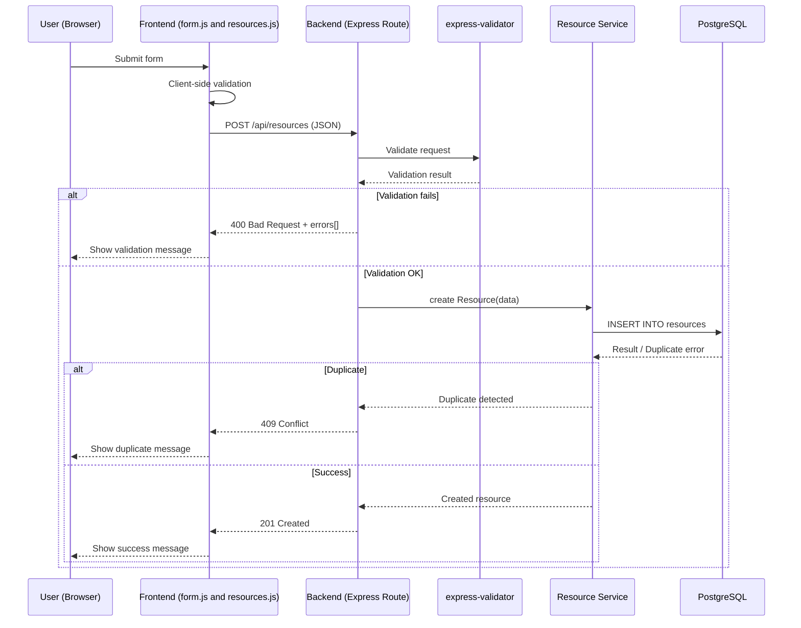

# 1️⃣ CREATE – Resource (Sequence Diagram)



# 2️⃣ READ — Resource (Sequence Diagram)

```mermaid
sequenceDiagram
    participant U as User (Browser)
    participant F as Frontend (form.js and resources.js)
    participant B as Backend (Express Route)
    participant V as express-validator
    participant S as Resource Service
    participant DB as PostgreSQL

    U->>F: Lue lomakeresurssi
    F->>B: GET /api/resources (JSON)
    B->>S: Read resource(data)
    S->>DB: SELECT * FROM resources
    DB-->>S: Lue resurssi

    alt Luku onnistui GET http://localhost:5000/api/resources
        B-->>F: 200 OK
        F-->>U: lue resurssi

    else Virheet
        S-->>B: not found
        B-->>:F 404 Not Found
        F-->>U: näytä virheviesti resource not found
    else duplikaatti
        B-->>F: 409 Conflict
        F-->>U: näytä virheviesti "Duplicate resource name"
    end
end
```

# 3️⃣ UPDATE — Resource (Sequence Diagram)

```mermaid
sequenceDiagram
    participant U as User (Browser)
    participant F as Frontend (form.js and resources.js)
    participant B as Backend (Express Route)
    participant V as express-validator
    participant S as Resource Service
    participant DB as PostgreSQL

    note Käyttäjä päivittää lomakeresussin tietoja
    U->>F: Update lomake
    F->>F: Client side validation
    F->>B: PUT /api/resources (JSON)

    alt Update onnistui PUT http://localhost:5000/api/resources/8 (id numero tietokannassa)
        B->>S: update Resource(data)
        S->>DB: UPDATE resources WHERE...
        DB-->>S: Update successful viesti
        S-->>B: päivitetty resurssi
        B-->>F: 200 OK
        F->>U: lue resurssi

    else Virheet:
        note HTTP/1.1 400 Bad Request
        {"ok":false,"errors":[{"field":"resourceDescription","msg":"resourceDescription can on
        ly contain letters, numbers, spaces and symbols ,.-"}]}

        note HTTP/1.1 409 Conflict
        {"ok":false,"error":"Duplicate resource name"}

        end
    end
```

# 4️⃣ DELETE — Resource (Sequence Diagram)

```mermaid
sequenceDiagram
    participant U as User (Browser)
    participant F as Frontend (form.js and resources.js)
    participant B as Backend (Express Route)
    participant V as express-validator
    participant S as Resource Service
    participant DB as PostgreSQL

    note Käyttäjä poistaa lomakeresurssin
    U-->>F: Poista lomakeresurssi
    F->>B: DELETE /api/resources (JSON)

    alt Poisto onnistui (DELETE http://localhost:5000/api/resources/10 (id numero tietokannassa/taulukossa)
        B->>S: delete Resource(Data)
        S->>DB: DELETE FROM resources
        DB-->>S: Delete onnistui

        S-->>B: Deleted resource
        B-->>F: 204 No Content
        F-->>U: Näytä viesti "(resource name) succefully deleted!"

    else Virheet:
    note Poisto epäonnistuu:
        B-->>F: 400 Bad Request + errors[]
        F-->>U: näytä viesti
    end
end
```
