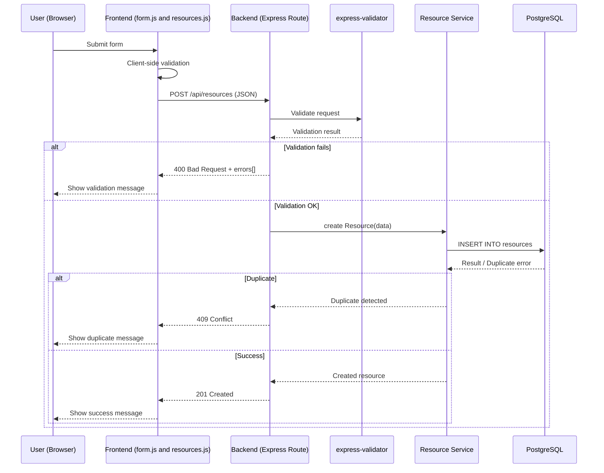

# 1️⃣ CREATE – Resource (Sequence Diagram)



# 2️⃣ READ — Resource (Sequence Diagram)

```mermaid
sequenceDiagram
    participant U as User (Browser)
    participant F as Frontend (form.js and resources.js)
    participant B as Backend (Express Route)
    participant V as express-validator
    participant S as Resource Service
    participant DB as PostgreSQL

2. Päätepiste ja metodi:
GET http://localhost:5000/api/resources
GET metodilla luettu (Read)
päätepiste = http://localhost:5000/api/resources

3. Onnistuminen:
Luodun (Create) resurssin lukeminen (Read) onnistuu = 200 OK
Lisätty resurssi näkyy "Resource List" kohdassa selaimessa

4. Virheen sattuessa:
resurssia ei löydy:
{"ok":false,"error":"Resource not found"}

Lukeminen curl komennolla:
HTTP/1.1 409 Conflict
{"ok":false,"error":"Duplicate resource name"}

```

# 3️⃣ UPDATE — Resource (Sequence Diagram)

```mermaid
sequenceDiagram
    participant U as User (Browser)
    participant F as Frontend (form.js and resources.js)
    participant B as Backend (Express Route)
    participant V as express-validator
    participant S as Resource Service
    participant DB as PostgreSQL

    User updates a resource
    U->>F: Update form
    F->>F: Client side validation
    F->>B: PUT /api/resources (JSON)

    Update successful PUT http://localhost:5000/api/resources/8 (id number in database)
        B->>S: update Resource(data)
        S->>DB UPDATE resources
        DB-->>S: Update successful message
        S-->>B: Updated resource
        B-->>F: 200 OK

    Error:
        HTTP/1.1 400 Bad Request
        {"ok":false,"errors":[{"field":"resourceDescription","msg":"resourceDescription can on
        ly contain letters, numbers, spaces and symbols ,.-"}]}

        HTTP/1.1 409 Conflict
        {"ok":false,"error":"Duplicate resource name"}
```

# 4️⃣ DELETE — Resource (Sequence Diagram)

```mermaid
sequenceDiagram
    participant U as User (Browser)
    participant F as Frontend (form.js and resources.js)
    participant B as Backend (Express Route)
    participant V as express-validator
    participant S as Resource Service
    participant DB as PostgreSQL

    U-->>F: Delete from
    F->>B: DELETE /api/resources (JSON)

    Delete succesful (DELETE http://localhost:5000/api/resources/10 (id number in database)
        B->>S: delete Resource(Data)
        S->>BD: DELETE FROM resources
        DB-->>S: Delete successful

        S-->>B: Deleted resource
        B-->>F: 204 No Content
        F-->>U: Show success message "(resource name) succefully deleted!"

    Error:
    Delete fails:
        B-->>F: 400 Bad Request + errors[]
        F-->>U: Show message
    end
end
```
